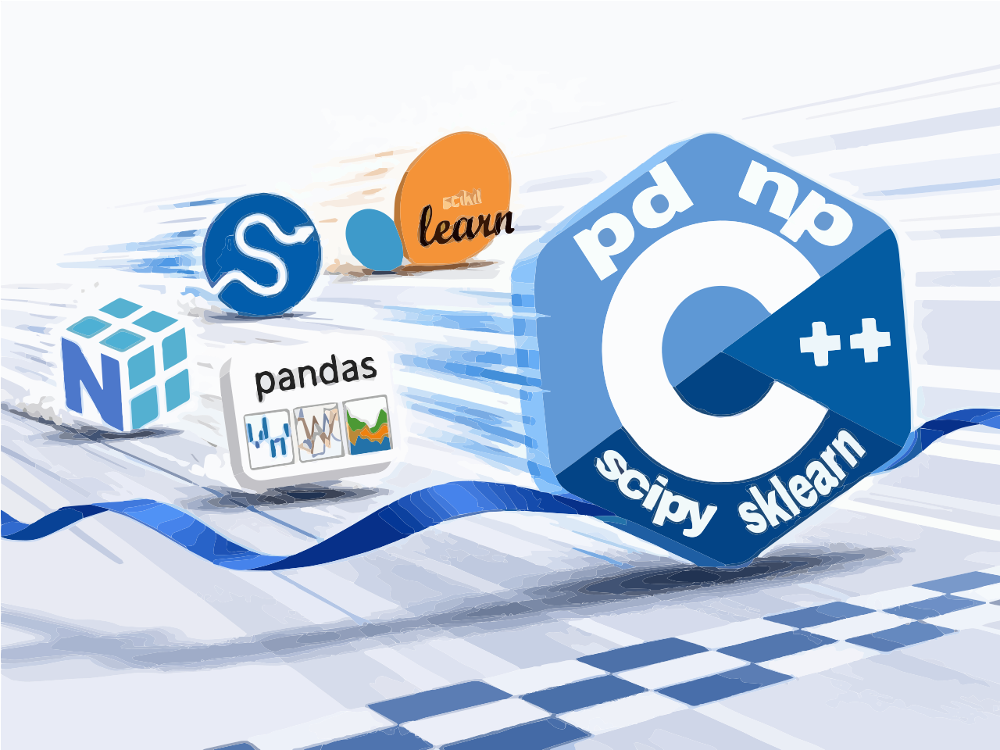

[](https://ci.appveyor.com/project/mgorshkov/pd/branch/main)



# About
⚡ Data manipulation and analysis library in C++ | CUDA GPU + SIMD (AVX2/AVX512/AMX) CPU CPU

# Requirements
C++20-compatible compiler:
* gcc 13 or higher
* clang 14 or higher
* Visual Studio 2019 or higher
* CUDA development environment (NVIDIA CUDA Toolkit, and compatible NVIDIA drivers installed) to use CUDA optimizations (nvcc 12 or higher)

# Repo
```
git clone https://github.com/mgorshkov/pd.git
```

# Build library and unit tests
```
./scripts/build.sh
```

# Build docs
```
cmake --build . --target doc
```

Open scipy/build/doc/html/index.html in your browser.

# Install
```
cmake .. -DCMAKE_INSTALL_PREFIX:PATH=~/pd_install
cmake --build . --target install
```

# Usage example (samples/read_csv)
```
#include <iostream>

#include <pd/read_csv.hpp>

int main(int, char **) {
    using namespace pd;

    auto df = read_csv("https://raw.githubusercontent.com/adityakumar529/Coursera_Capstone/master/diabetes.csv");
    std::cout << "df.shape=" << df.shape() << std::endl;
    const char *non_zero[] = {"Glucose", "BloodPressure", "SkinThickness", "Insulin", "BMI"};
    for (const auto &column: non_zero) {
        df[column] = df[column].replace(0L, np::NaN);
        auto mean = df[column].mean(true);
        df[column] = df[column].replace(np::NaN, mean);
    }

    auto X = df.iloc(":", "0:8");
    auto y = df.iloc(":", "8");

    std::cout << "X=" << X << std::endl;
    std::cout << "y=" << y << std::endl;

    return 0;
}
```
# How to build the sample

1. Clone the repo
```
git clone https://github.com/mgorshkov/pd.git
```
2. Build the library
```
./scripts/build.sh
```
3. cd samples/read_csv
```
cd samples/read_csv
```
4. Make build dir
```
mkdir -p build && cd build
```
5. Configure cmake
```
cmake -DCMAKE_BUILD_TYPE=Release ..
```
6. Build
## Linux/MacOS
```
cmake --build .
```
## Windows
```
cmake --build . --config Release
```
6. Run the app
```
$./read_csv

```

# Links
* ⚡ NumPy-style arrays in C++ | CUDA GPU + SIMD (AVX2/AVX512/AMX) CPU CPU: https://github.com/mgorshkov/np
* ⚡ SciPy methods in C++ | CUDA GPU + SIMD (AVX2/AVX512/AMX) CPU CPU: https://github.com/mgorshkov/scipy
* ⚡ ML methods in C++ | CUDA GPU + SIMD (AVX2/AVX512/AMX) CPU CPU: https://github.com/mgorshkov/sklearn
